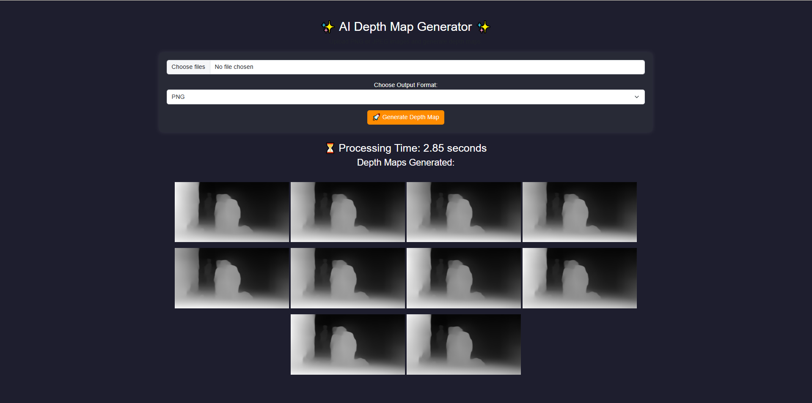

# 🌟 AI Depth Map Generator 🌟  

**AI Depth Map Generator** is a powerful tool that converts PNG and JPEG images (including image sequences) into accurate depth maps. With a user-friendly interface, it provides real-time processing time and progress updates, making depth estimation quick and efficient.  

## 🔥 Preview  
  

---

## 🔥 Features  
✅ Supports **PNG and JPEG** images (single images & sequences)  
✅ Generates high-quality **depth maps**  
✅ **Real-time processing time & progress updates**  
✅ Clean and modern **web interface**  

---

## 📥 Download Required Model Files  
To use this tool, download the following model files and place them in the project folder:  
- [openvino_midas_v21_small_256.xml](https://github.com/isl-org/MiDaS/releases/download/v3_1/openvino_midas_v21_small_256.xml)  
- [openvino_midas_v21_small_256.bin](https://github.com/isl-org/MiDaS/releases/download/v3_1/openvino_midas_v21_small_256.bin)  

---

## 🚀 How to Run  
### **1️⃣ Install dependencies**  
```bash
pip install -r requirements.txt
2️⃣ Run the application
bash
Copy
Edit
python app.py
3️⃣ Open in Browser
After running the app, open your browser and go to:
http://127.0.0.1:5000/

🛠 Requirements
✅ Python 3.7+
✅ OpenCV
✅ Flask
✅ OpenVINO Toolkit

Install all dependencies using:
bash
Copy
Edit
pip install -r requirements.txt
📌 Usage
1️⃣ Upload PNG or JPEG images (supports sequences).
2️⃣ Select the output format.
3️⃣ Click Generate Depth Map.
4️⃣ View and download the generated depth maps.

📂 Project Structure
graphql
Copy
Edit
AI-Depth-Map-Generator/
│── models/                  # MiDaS model files (XML & BIN)
│── static/                  # CSS & JavaScript files
│── templates/               # HTML files for UI
│── uploads/                 # Stores uploaded images
│── app.py                   # Flask backend
│── requirements.txt         # Dependencies
│── README.md                # Documentation
│── Preview.PNG              # UI preview image
💡 License
This project is open-source and available under the MIT License.
